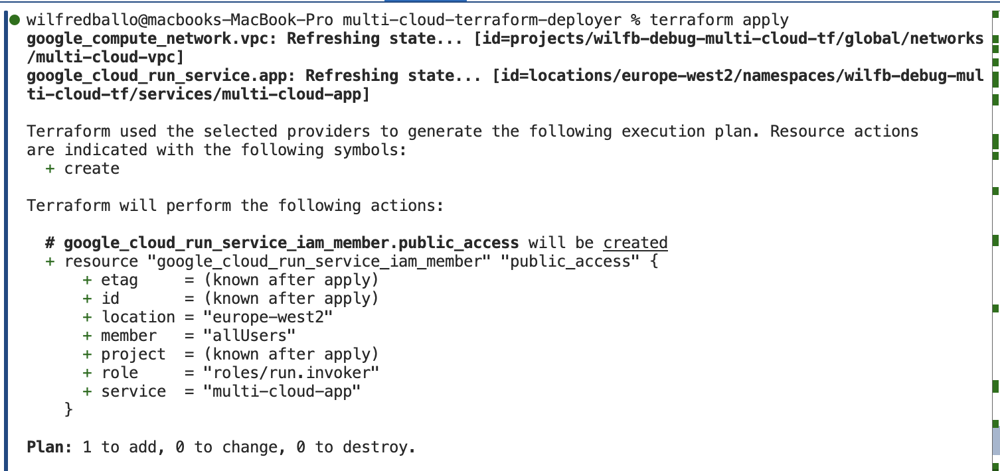
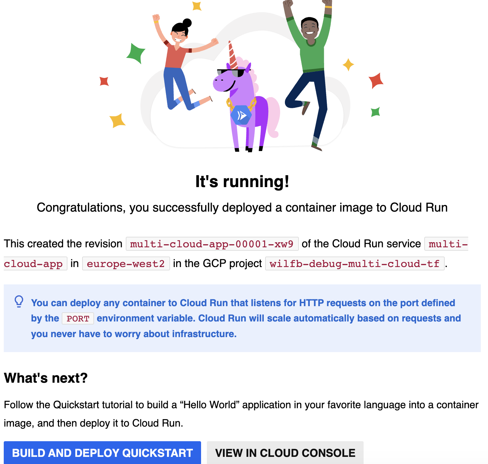
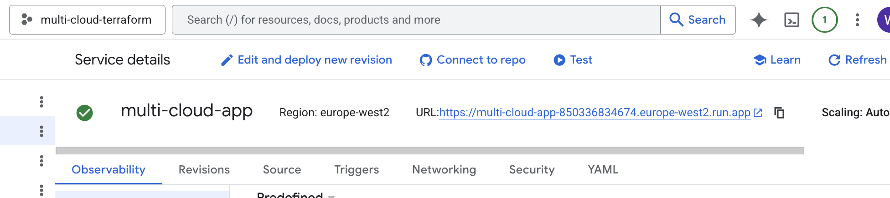

# Multi-Cloud Terraform Deployer

A Terraform-based infrastructure project that provisions and manages cloud resources across providers, starting with GCP and designed to extend to AWS.

---

## 🚀 Project Overview

This project demonstrates how to:

* Deploy cloud infrastructure using Terraform
* Separate environments (dev / prod)
* Automate validation using GitHub Actions
* Design for multi-cloud expansion (GCP → AWS)

---

## 🏗️ Architecture

### GCP Infrastructure

* VPC Network
* Cloud Run service (public endpoint)
* IAM configuration (public access)
* Secret Manager for application config

---

## 📸 Screenshots

### 1. Terraform Apply Success



---

### 2. Cloud Run Live URL



---

### 3. Cloud Run Service Running



---

## ⚙️ Features

* Multi-environment support (`dev` / `prod`)
* Infrastructure as Code (Terraform)
* GitHub Actions CI (init + validate)
* Clean repo structure for scaling
* AWS provider stub (ready for integration)

---

## 🧰 Tech Stack

* Terraform
* Google Cloud Platform (GCP)
* GitHub Actions

---

## 📁 Project Structure

```bash
.
├── main.tf
├── providers.tf
├── variables.tf
├── outputs.tf
├── environments/
│   ├── dev.tfvars
│   └── prod.tfvars
└── .github/workflows/terraform.yml
```

---

## 🔁 CI Pipeline

Runs automatically on push:

* terraform init
* terraform validate

---

## 🌍 Future Improvements

* Add AWS deployment
* Introduce Terraform modules
* Add secure CI auth (OIDC)
* Multi-region deployments

---

## 🧠 Key Learnings

* Multi-cloud architecture design
* Terraform workflows (init / plan / apply)
* CI/CD for infrastructure
* Environment-based deployments

